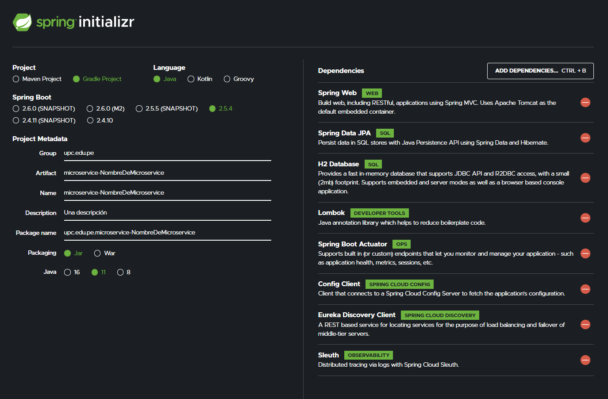

<<<<<<< HEAD
# Plantilla para la creación de un micro-service

Guiá para la configuración

## Dependencias

* Spring Web
* Spring Data Jpa
* H2 Database
* Lombok
* Spring Boot Actuator (dependencia comentada)
  * Esta dependencia permite manejar endpoints (creo que son cosas de orquestacion)
* Config Client (dependencia comentara)
  * Configuraciones desde el servidor
* Eureka Discovery Client (dependencia comentara)
  * Herramienta para gestionar los servicios
* Sleuth (dependencia comentada)
  * Controles via log (es para mostrar errores)

=======
# Jobag

Aplicación enfocada en mejorar el proceso de selección en las empresas
ofreciendo una plataforma donde puedan publicar, recibir y ejecutar
los procesos de selección que tengan disponibles.
>>>>>>> 1e7dd0b277834892d3f2f3c6f3a10d14d36d70eb
